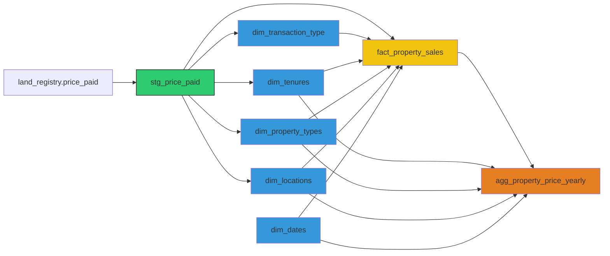
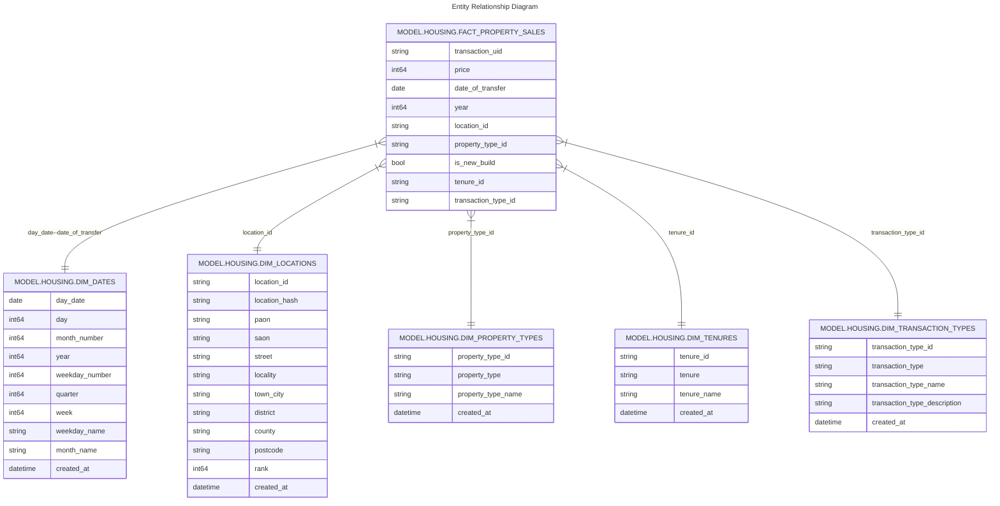

# Models 

## Lineage Graph

The graph below provides an overview of how the data is transformed from the external table (`land_registry.price_paid`) to the fact and dimension tables and finally to an analytics specific aggregate table.

#### External Table: land_registry.price_paid

The price paid data source is stored as parquet files in a Google Cloud Storage (GCS) bucket called "processed".

Using [dbt_external_tables](https://github.com/dbt-labs/dbt-external-tables), I created an external table that references these price paid data files stored in GCS.

**Partitioning**

I stored my data in a Hive-like structure in GCS, organizing the files by year (/year/pp-{year}.parquet). When creating the external table, BigQuery automatically recognizes the partitioning by year and creates an external table partitioned by year.

I have partitioned my downstream fact table by year. The fact table is built from a staging view over the external table. By partitioning the external table by year, I wanted to create the potential for efficiencies in data loading to my partitioned fact_table e.g. if my fact table held property transactions for a **subset** of the years held in my external table then BigQuery would only need to read the relevant partitions, improving performance.

At the moment, I am loading all years because I am interested in how properties have changed in the past 30 years and because my source data is constantly being updated i.e. it is possible for a transaction from 1996 to have an update in the current month. To handle this possibility, the simplest solution was to download, transform and load all yearly source files. 

In the future a more efficient pattern might be to examine the monthly file and if no updates were made for a given year, avoid reprocessing that year.  

#### Staging View: stg_price_paid

`stg_price_paid` is a view over the external_table where I cast the price paid data into appropriate data types for use by downstream fact and dimension tables

### Fact and Dimension Tables

I have followed Kimball's dimensional modelling process to design my core tables to follow a star schema.

#### Dimension tables

There are 5 dimension tables:
- `dim_date`: Autogenerated to hold dates from January 1st 1995 to January 1st 2026 broken down by year, weekday etc.

- `dim_locations`: Extracted from `stg_price_paid` holds unique location information (currently addresses), which can be used to identify unique properties

- `dim_property_types`:Extracted from `stg_price_paid` holds information about whether the property is Detached, Semi-Detached, Terraced, Flats/Maisonettes or Other. 

- `dim_tenures`: extracted from `stg_price_paid` holds details of whether the property was a Leasehold or Freehold

- `dim_transaction_types`: extracted from `stg_price_paid` holds details of the type of Price Paid transaction (see dbt docs for more information).

**Why not use seed tables?**

`dim_property_types`,`dim_tenures` each hold < 10 rows of data and it would have made sense to use a seed table. The problem that I had is that the creator of the source data (the UK Land Registry) had no official document that could act as a source of truth. I was afraid that there could be changes that would break the pipeline and I wanted to avoid this. This is inefficient however and in the future I will check for changes earlier on in the pipeline. 

I did consider whether I wanted to keep track of changes (is this a slow changing dimension problem?) but I don't care about how property types were defined in the past, I only care about how they are defined now and make the assumption, since the Land Registry update their past yearly files monthly as needed, any changes in their categories would be reflected throughout their data.

**Incremental Materialization**

All my dimension tables are updated incrementally that is only new or changed data is processed/ inserted into the table, which menas that I am not refreshing or rebuilding the entire table every time.

For most of my dimension tables, this means that they are created once (e.g. `dim_dates`) and no further updates are needed. The table that does update is `dim_locations` because new properties are sold each year.

This strategy provides the following benefits:
- faster processing times since only new/changed data is processed
- lower costs since less data is processed

#### Fact Table: `fact_property_sales`

The grain of the fact table is a property transaction i.e. a property sale on a particular date. 

The fact table has over 29 million rows i.e. 29 million property sales.

**Partitioning**

`fact_property_sales` is partitioned by year to speed up queries: `agg_property_price_yearly` use the fact table to create summary statistics about property prices by year. By partitioning the fact table by year we make these queries faster and cheaper.

