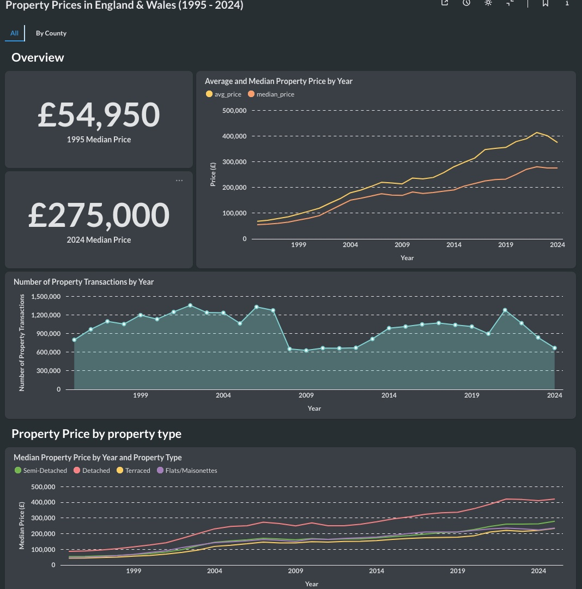
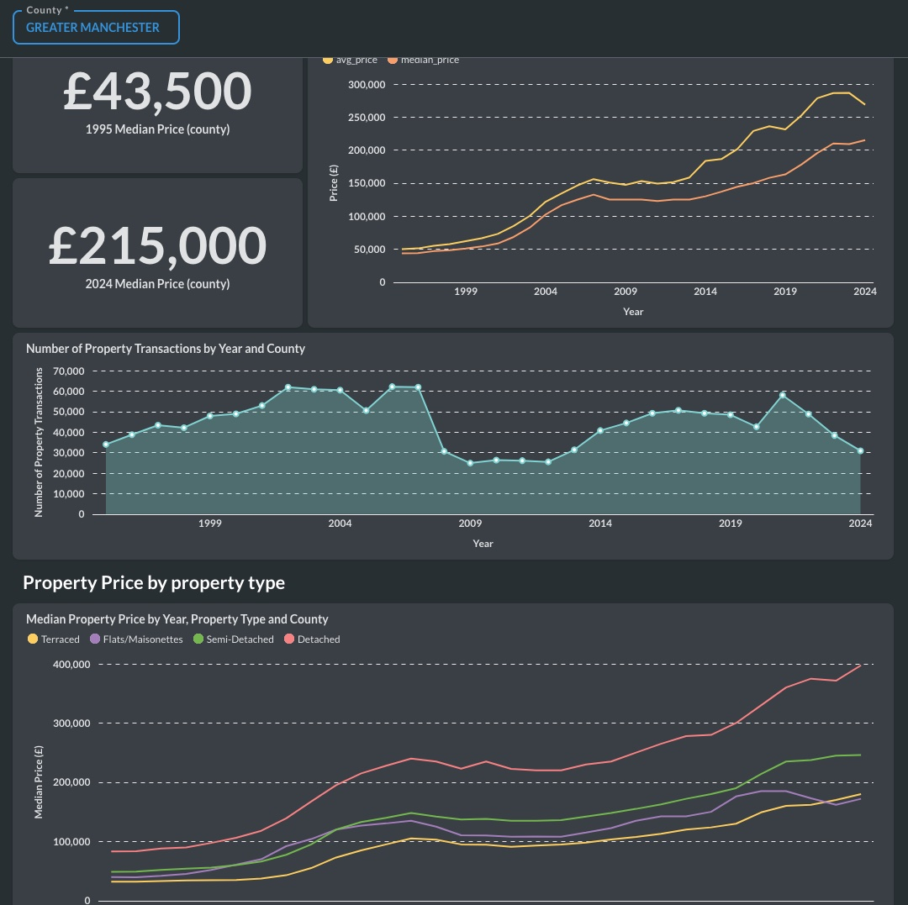

# SQL Queries: Metabase Questions

This is an overview of the Questions/SQL queries I created with Metabase's native query editor.

I created two tabs on my dashboard: one that showed metrics for properties in England and Wales over the last 30 years and another that showed the same information filtered by location (County). Both dashboards contain the same tiles: the only difference between them is the filtering.

**Before writing your SQL queries in the editor, make sure you have the correct database i.e. `Property Prices` (or whatever `Display Name` value you used during the BigQuery database connection setup).**

## Main dashboard (All)



### 1. 1995 Median Price

```sql
SELECT median_price
FROM `housing.agg_property_price_yearly`
WHERE county IS null
AND property_type_name IS null
AND is_new_build IS null
AND tenure_name IS null
AND year = 1995
```

**Visualization**: Number

**Visualization Cog**: Add `£` prefix

### 2. 2024 Median Price

```sql
SELECT median_price
FROM `housing.agg_property_price_yearly`
WHERE county IS null
AND property_type_name IS null
AND is_new_build IS null
AND tenure_name IS null
AND year = 2024
```

**Visualization**: Number

**Visualization Cog**: Add `£` prefix

### 3. Average and Median Property Price by Year

```sql
SELECT  year, avg_price, median_price
FROM `housing.agg_property_price_yearly` 
WHERE county is NULL
AND property_type_name IS NULL
AND tenure_name IS NULL
AND is_new_build IS NULL
AND year IS NOT NULL
AND year < 2025;
```

**Visualization**: Line

**Visualization Cog**: Make sure the X-axis is `year` and the Y-axis is `avg_price` and `median_price`.

### 4. Number of Property Transactions by Year

```sql
SELECT year AS Year,
    num_transactions AS `Number of Property Transactions`
FROM `housing.agg_property_price_yearly` 
WHERE county IS NULL
AND property_type_name IS NULL
AND tenure_name IS NULL
AND is_new_build IS NULL
AND year < 2025
ORDER BY year;
```

**Visualization**: Area

**Visualization Cog**: Make sure the X-axis is `year` and the Y-axis is `Number of Property Transactions`.

### 5. Median Property Price by Year and Property Type

```sql
SELECT year, property_type_name, median_price
FROM `housing.agg_property_price_yearly`
WHERE year is NOT null
AND property_type_name IS NOT null
AND tenure_name IS null
AND is_new_build IS null
AND county IS null
AND property_type_name != 'Other'
ORDER BY year;
```

**Visualization**: Line

**Visualization Cog**: Make sure the X-axis is `year` and the Y-axis is `median_price`. Then add another series (property_type_name) to show median price by property_type.


## Location/ by county dashboard



**Field Filters**

Before completing this section, I suggest you watch the [Field filters Metabase tutorial](https://youtu.be/jLIThmu7BVU?feature=shared). All of the queries below rely on creating a `Field Filter` variable.

When you use the `{{}}` syntax (see sql queries below), the `Variables` pane (`{x}`) will automatically open up. For all of the queries below you will need to create this  variable:

- Variable Name: County
- Variable type: Field Filter
- Field to map to: Agg Property Price Yearly -> County
- Filter widget type: String
- Filter widget label: County
- How should users filter on this variable?: Dropdown list
- Default filter widget value: GREATER LONDON 
- Always require a value: enable

**Queries**

All the queries for this dashboard are the same except that you need to configure the Field Filter

### 1. 1995 Median Price (county)

```sql
SELECT median_price
FROM `housing.agg_property_price_yearly`
WHERE {{ county }} -- change this and add your variable configuration to create the filter 
AND property_type_name IS null
AND is_new_build IS null
AND tenure_name IS null
AND year = 1995
```

### 2. 2024 Median Price (county)

```sql
SELECT median_price
FROM `housing.agg_property_price_yearly`
WHERE {{ county }}
AND property_type_name IS null
AND is_new_build IS null
AND tenure_name IS null
AND year = 2024
```

### 3. Average and Median Property Price by Year and County

```sql
SELECT  year, avg_price, median_price
FROM `housing.agg_property_price_yearly` 
WHERE {{ county }}
AND property_type_name IS NULL
AND tenure_name IS NULL
AND is_new_build IS NULL
AND year IS NOT NULL
AND year < 2025;
```

### 4. Number of Property Transactions by Year and County

```sql
SELECT year AS Year,
    num_transactions AS `Number of Property Transactions`
FROM `housing.agg_property_price_yearly` 
WHERE {{ county }}
AND property_type_name IS NULL
AND tenure_name IS NULL
AND is_new_build IS NULL
AND year < 2025
ORDER BY year;
```

### 5. Median Property Price by Year, Property Type and County

```sql
SELECT year, property_type_name, median_price
FROM `housing.agg_property_price_yearly`
WHERE year is NOT null
AND property_type_name IS NOT null
AND property_type_name != 'Other'
AND tenure_name IS null
AND is_new_build IS null
AND {{ county }}
ORDER BY year;
```